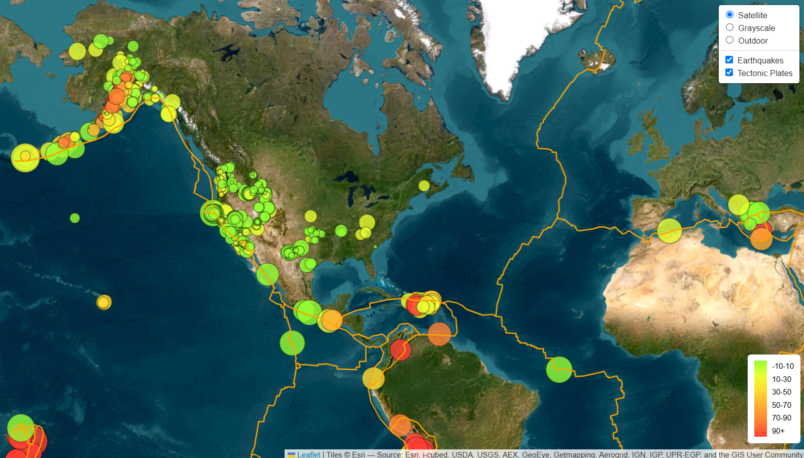

# Christine Bilinski

### Customer Success | Data Analytics | SaaS Operations

Helping teams improve customer experiences through **data insights, dashboards, and analytics**.

---

# 👋 About Me

I’m a **Data Analytics Bootcamp graduate** with a background in **Customer Success and operations support**.

I enjoy turning complex data into **clear visual insights** that help teams understand trends, solve problems, and make better decisions.

My work focuses on:

- Data visualization
- Interactive dashboards
- Customer analytics
- Process improvement

Think of this page as a **small museum of data projects**.

No technical background required — just click and explore.

---

# 🚀 Portfolio Projects

## 🌎 Earthquake Visualization Map

Interactive map showing global earthquake activity using **Leaflet.js**.

View Project  
https://cbilinski101.github.io/leaflet-challenge/

---

## 📊 Interactive Data Dashboard

Interactive dashboard exploring patterns and trends in data.

View Project  
https://cbilinski101.github.io/Project-3/

---

## 🧫 Belly Button Biodiversity Dashboard

Dashboard exploring bacteria cultures using **Plotly.js**.

View Project  
https://cbilinski101.github.io/belly-button-challenge/

---

# 🧰 Technical Skills

### Programming
- Python
- JavaScript

### Data Visualization
- Plotly
- Leaflet
- Interactive Dashboards

### Web Technologies
- HTML
- CSS
- GitHub Pages

### Data Skills
- Data Analysis
- Data Visualization
- Dashboard Design
- Data Storytelling

---

# 💼 Professional Experience

I currently work as a **Live Services Agent at ServiceTitan**, helping customers solve problems and ensuring a smooth service experience.

My background includes:

- Customer Success
- Relationship management
- Problem resolution
- Data reporting
- Process improvement

I enjoy combining **customer insight with analytics** to improve systems and experiences.

---

# 📄 Resume

Download my resume here:

[Christine Bilinski Resume](Christine_Bilinski_Resume.pdf)

---

# 🔗 Connect With Me

LinkedIn  
https://linkedin.com/in/christine-b-19367b31b

GitHub  
https://github.com/cbilinski101

Email  
cbilinski101@gmail.com

---

⭐ Thanks for visiting my portfolio.

If you made it this far, congratulations.

You now officially know more about **belly-button bacteria dashboards** than most people on Earth.
